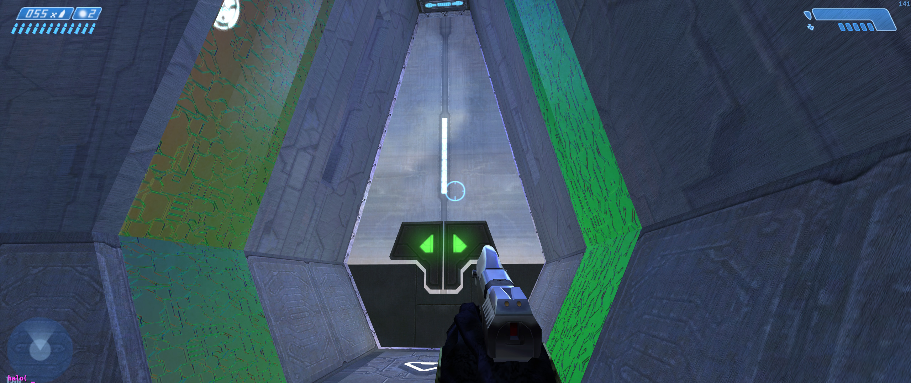
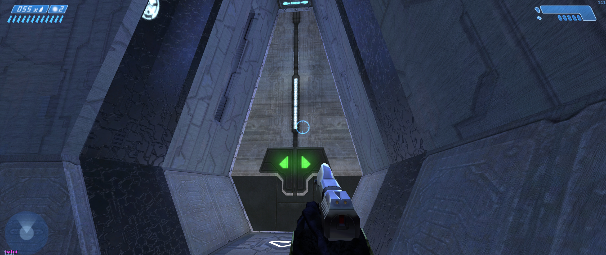
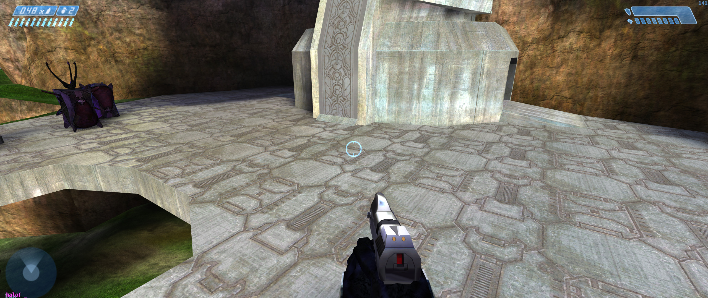
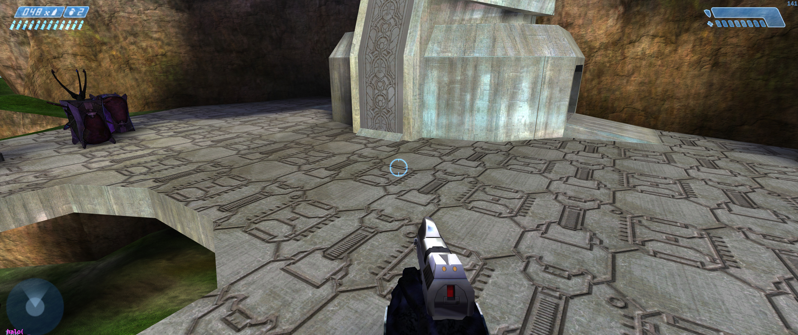
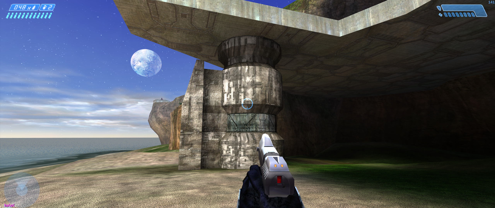
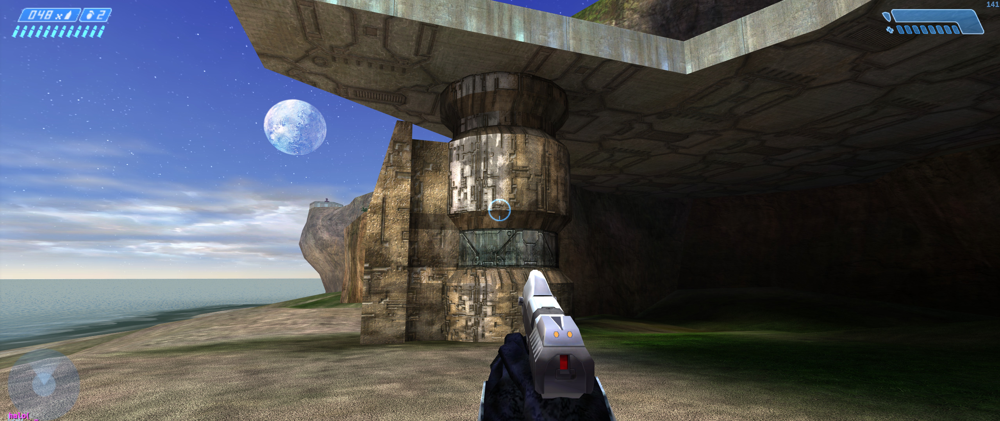

<html>
    <p align="center">
        
    </p>
    <h1 align="center">CEnshine</h1>
    <p align="center">
       Shaders enhancement for Halo Custom Edition aiming to restore Xbox accurate rendering
    </p>
    <p>&nbsp;</p>
</html>

This project is made with the goal of improving Halo Custom Edition shaders and align them with the
shaders quality provided in the MCC/Xbox version of the game, just by the joy of doing it, all of
this is the result of almost 2 weeks of hard work to bring a well deserved set of shaders to
Halo Custom Edition as Gearbox left us with broken version of almost all the shaders.

CEnshine was made possible using primarily Lua and HLSL, take a look at the source files on this
repository.

For a more deeper introduction to shader encryption see [Composer](https://github.com/JerryBrick/composer) a CLI set of programs made
with C++ for decrypting, encrypting of shaders.

**Install it with [Mercury](https://github.com/Sledmine/Mercury):**
```
mercury install censhine
```
Or manually get it from the [releases](https://github.com/Sledmine/censhine/releases) page.

# Fixes so far
Some of the things we have fixed with these shaders so far are listed below, as well as unmarked all
the things we plan to do to restore at some point as well.
- **Shader Transparent Plasma** - (Plasma based shaders will render properly, for example biped shields recharge)
- **Environment Reflection** - (Bumped surfaces now will tint correctly perpendicularly and horizontally, dynamic mirror seems to work properly now, needs testing)
- **Environment Light Maps** - (Light map direction will now apply correctly to other textures like bump maps)
- **Transparent Glass Reflection** Bumped - (Glass with bumped reflections)
- **Transparent Water** - (Water color and opacity)
- **Environment Model** - (Objects now draw behind fog, animations fade correctly, cube map alpha applies correctly)
- **Environment Texture** - (Restored normal, blended and blended base specular function types, self illumination works as expected)

**NOTE:** There are still pending some shaders and functions to fix, every feedback from what shaders are missing to fix or what they can be breaking even more is totally appreciated.

We are also trying to keep compatibility with dgVoodoo!

There are some plans to bring some removed shaders back like the **"Shader Transparent Generic"**, but that will require something a little bit more complex, stay tuned to more updates.

# Screenshots
Here are some 2K screenshots demonstrating changes between the broken shaders and the fixed ones, just
to show a few, shaders include other fixes that require looking at them in game to appreciate:

**BEFORE**

**AFTER**

**BEFORE**

**AFTER**

**BEFORE**

**AFTER**


# Thanks to
- [JerryBrick](https://github.com/JerryBrick) - Composer tools creator, tools for decrypting and encrypting shaders **(show some love to Jerry, he is leaving the modding scene)**
- [MrChromed](https://www.youtube.com/c/MrChromed) - Halo CE Shaders veteran, providing support for validating shaders fixes
- [MarkMcFuzz](https://youtube.com/channel/UCa2MHGKv8KZFBBkkFzNBgkA) - Another Halo CE Shaders veteran, support and validation
- [Mata](https://youtube.com/channel/UCa2MHGKv8KZFBBkkFzNBgkA) - 3D expert, probably the igniter of this
  project, when Mata started to learn about HLSL we got inspired to try and attempt to fix CE
  shaders
- [C20](https://c20.reclaimers.net/h1/engine/renderer/#gearbox-regressions) - Provided a list of known shaders issues